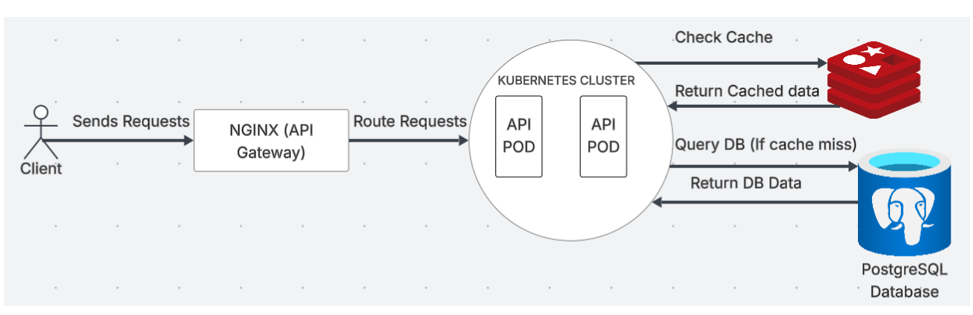
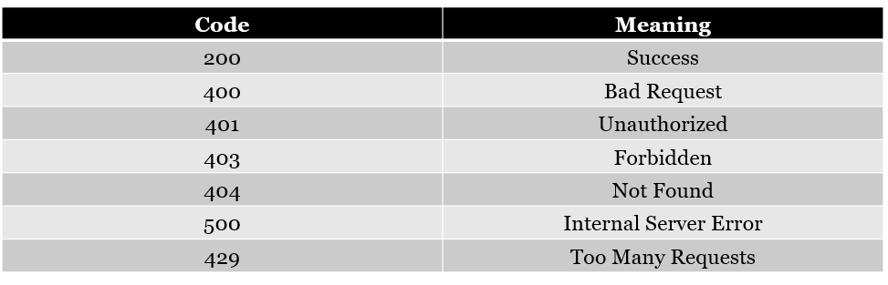

# Student Payments Integration API

## Table of Contents
- Project Overview
- Features
- Architecture
- Getting Started
- Prerequisites
- Setup Instructions
- Environment Variables & Configuration
- Running the Application
- Authentication
- Usage Workflow
- Error handling


## Project Overview
This API allows seamless integration between banks and universities for student payment notification processing. It enables banks to validate students and send payment notification information to universities, allowing universities to reconcile payments made by students at the bank.

## Features
- Student registration onto the database.
- Student Validation of enrollment status and existence.
- Admin management of bank clients (Client ID / Client Secret)
- Machine-to-machine (M2M) authentication for banks using OAuth 2.0
- Admin management of student dues.
- Payment notification addition for student payments.
- Dockerized deployment

## Getting Started

## Architecture
- The diagram illustrates the architectural diagram of the application. It provides a high-level overview of the approach to the problem.


### Prerequisites
- Docker desktop installed
- IDE e.g Visual Studio Code

## Setup Instructions
1. Clone the repository:
    ```bash
   git clone https://github.com/Mudibo/StudentPayments_API.git
   cd STUDENTPAYMENTS_API
2. Configure environment variables (see below). Replace each variable with the actual value.

## Environment Variables & Configuration
- Create a .env file with the following environment variables configured:
- ASPNETCORE_ENVIRONMENT=Production
- ConnectionStrings__DefaultConnection=${ConnectionStrings__DefaultConnection}
- Jwt__Secret=${Jwt__Secret}
- Jwt__Issuer=${Jwt__Issuer}
- Jwt__Audience=${Jwt__Audience}
- Jwt__TokenLifetimeMinutes=${Jwt__TokenLifetimeMinutes}
- ConnectionStrings__Redis=${ConnectionStrings__Redis}
- POSTGRES__USER=
- POSTGRES_PASSWORD=
- POSTGRES_DB=
- PGADMIN_DEFAULT_EMAIL=
- PGADMIN_DEFAULT_PASSWORD=

## Running the Application
1. App Setup
    ```bash
    docker-compose up --build

2. In order to access the interactive API documentation, navigate to and test the API endpoints:
    ```bash
    http://localhost:8080/swagger/index.html

3. In order to access the pgAdmin interface for database management, navigate to :
    ```bash
    http://localhost:5050/

## Authentication
1. Admin Authentication:
Admins log in to manage bank clients and student dues.

2. Bank M2M Authentication
Banks authenticate using their ClientId, ClientSecret, grant_type, and scope to obtain a token.

## Usage Workflow
1. Student Registration: Students register on the platform
2. Admin logs in and adds bank clients, specifying their ClientId, ClientSecret, and allowed scopes for policy-based access control.
3. Admin add dues for students
4. Bank authenticates via M2M to obtain a token.
5. Student Validation: Bank Validates student before payment.
6. Payment Processing: Student pays at the bank.
7. Payment Notification: Bank sends payment notification information to the university via the API.

## Error Handling
- The API has been designed to gracefully handle errors. The following is a summary of the errors thrown by the API and their corresponding status codes:

- A 200 (Success) response status code has been used to depict a successful operation was carried out.
- A 400 (Bad Request) response has been used to illustrate that the API received an incorrect request format.
- A 401 (Unauthorized) response depicts that invalid credentials have been submitted and thus the API cannot verify the identity of the client.
- A 403 (Forbidden) response illustrates that the client is attempting to request for a resource which it is not authorized to.
- A 404 (Not found) response has been used to depict that the resource being requested for does not exist.
- A 500 (Internal Server Error) is thrown when an error that has not been accounted for during development has been thrown.
- A 429 (Too many requests) response is given when the client sends to many requests to endpoints that have been rate limited.


